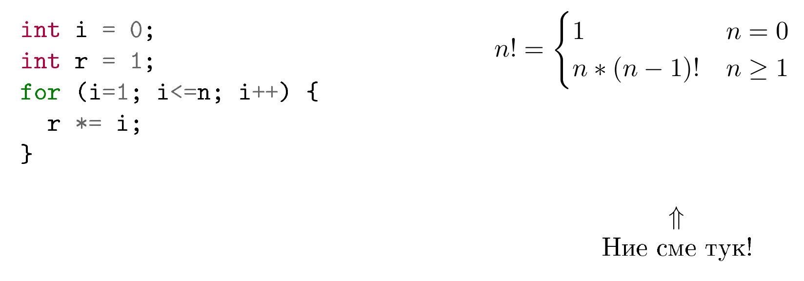

<!--
    page_number:true
    *page_number:false
-->

Въведение във 
Функционалното Програмиране.  
История на Haskell
==

<br>
<br>
<br>

Георги Наков, [nakov.gl at gmail com](mailto:nakov.gl+tues@gmail.com)  
Марин Маринов, [marinov.ms+tues at gmail com](mailto:marinov.ms+tues@gmail.com)
   
Технологично училище "Електронни Системи"  
19 Октомври 2016г.

---
## Какво е функционално програмиране?
- няма общоприета дефиниция
- програмиране с (неточно математически) функции
<br>

<p align="center">
  
</p>

---

## Характеристики на ФП
- едни и същи аргументи на функция - винаги един и същ резултат
- данните не могат да се мутират
- функциите нямат странични ефекти

---

## Характеристики на ФП
- 'променливите' не могат да се променят
- използва се само рекурсия (няма цикли)

---

## Предимства на ФП
- без скрити състояния
- по-малък когнитивен товар
- обосновавате се за поведението на функцията много по-лесно
- софтуерът е комбинируем *(compositional)*
<br>
```
 x = 42;
 someFunction(x);
 y = x + 1;
 //каква е стойността на y?
```
---

## Предимства на ФП
- програмите се парарелизират естествено
- тестват се по-лесно
- по-малко бъгове
<br>... *но това ли е цялата магия?*

---
## Функции от по-висок ред
- приемат за аргументи или връщат като стойност други функции
- инструмент за *слепяне* на различните подпроблеми
- основен изграждащ блок на абстракциите в езика


---
## Функции от по-висок ред - пример
- QuickSort
<p align="center">
  
</p>

---
## Мързеливо оценяване
- резултатите от функции **не** се изчисляват преди да се необходими
- практичесно неприложимо при функции със странични ефекти
```hs
f x y z = 
        if x>0 then x+y else x+z

f (5*6) (10-7) (5/0)
-- не се хвърля грешка
```
---
## Мързеливо оценяване
- средство за структириране
- по-ясно разделение между подпроблемите

<p align="center">
  
</p>

---
## Statement vs expression
- statement - какво извършва кодът
- expression - какво изчислява кодът
  - винаги има резултат
- функционалните езици са базирани на expression-и

---
## История на ФП
- 1940 - ламбда смятане на Алонсо Чърч
- 1958 - Lisp
- 1970-1990 - множество функционални езици с мързеливо оценяване
  - Miranda 
---
## Раждането на Haskell
- 1988 - дискусии по мейлинг листи
  - създава се комитет по разработването на нов, обединяващ език
- 01.04.1990 - първа версия на Haskell
  - по-стар от Python, Ruby, Java, C#, JavaScript
  - само 30к реда код (през 2011 са вече 140к)
- кръстен е на Хаскел Къри - aмерикански математик

---
## Раждането на Haskell
- *Haskell Committee* през 1992
<p align="center">
  
</p>

---
## Защо ФП и Haskell има значение
- **много от идеите се имплементират в други езици и библиотеки**
  - анонимни функции в Java 8, LINQ в C#
- много от принципите на ФП се препоръчват, независимо от езика 
- разработват се нови ФП езици
  - Scala, Clojure, F#


---
## Защо ФП и Haskell има значение

- Big Data индустрията е *"вдъхновена"* от  ФП
  - Map Reduce, Hadoop
- Facebook използва Haskell! *(магичната мантра)*
- John Carmack препоръчва Haskell!
